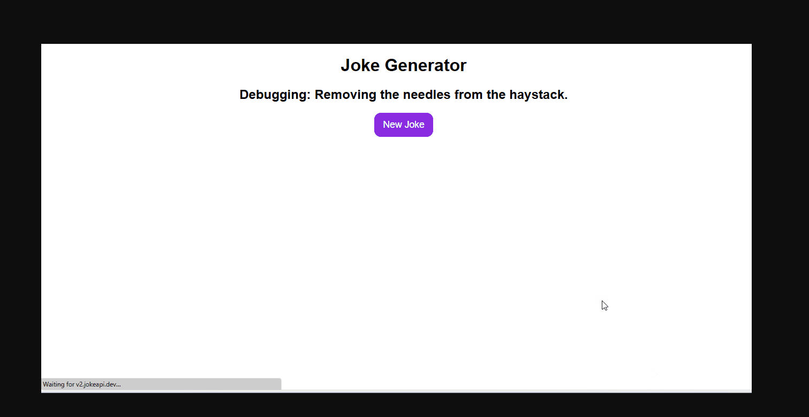

# 😂 Joke Generator App

A simple React app that fetches and displays random jokes using React Hooks.

## 🚀 Features

- Fetches random jokes from an external API
- Utilizes React functional components and Hooks (`useState`, `useEffect`)
- Clean and responsive UI

## 🛠️ Tech Stack

- React
- JavaScript (ES6+)
- HTML5 & CSS3
- [Joke API](https://official-joke-api.appspot.com/)

## 📸 Screenshots



## 📦 Installation

1. Clone the repository:

   ```bash
   git clone https://github.com/kshirsagarSandeep/joke-generator-react.git
   
2. Navigate to the project directory:
   cd joke-generator-react
3. Install dependencies:
  npm install
4.  Start the development server:
  npm start
5. The app will run on http://localhost:3000.

📁 Folder Structure
joke-generator-react/
├── public/
│   └── index.html
├── src/
│   ├── components/
│   │   └── Joke.js
│   ├── App.js
│   ├── index.js
│   └── App.css
├── package.json
└── README.md


### 📌 Next Steps:

1. **Update `README.md`**: Replace the existing content with the above structure. Customize it based on your project's specifics.
2. **Add a Screenshot**: Take a screenshot of your app and save it as `screenshot.png` in the root directory.
3. **Commit and Push**: After making changes, commit them and push to your GitHub repository.

If you need assistance with any of these steps or want me to generate a customized `README.md` file for you, feel free to ask!
::contentReference[oaicite:4]{index=4}
